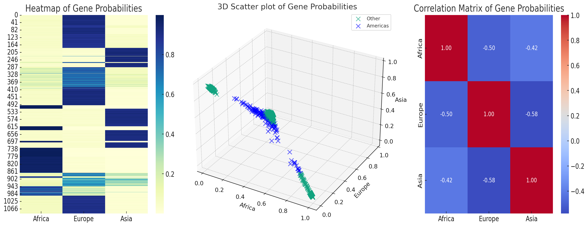

# Topic_Models_Ancestry_Inference

## Project Introduction
This project involves implementations related to topic models and ancestry inference.

## Task 1: PLSA Model Experiment

In Task 1, we conducted experiments with the PLSA model and obtained a graph showing the change in log_likelihood.

## Task 2: Ancestry Inference

In Task 2, we performed ancestry inference on 1092 samples using the PSD model and obtained proportions of blood types for each continent.

